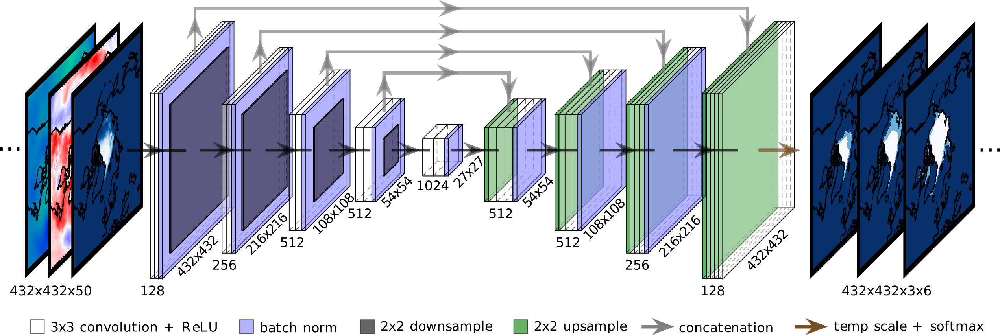

# IceNet: Seasonal Arctic sea ice forecasting with probabilistic deep learing

[](https://doi.org/10.5281/zenodo.5176573)

This codebase accompanies the Nature Communications paper [_Seasonal Arctic sea
ice forecasting with probabilistic deep
learning_](https://www.nature.com/articles/s41467-021-25257-4). It includes code to fully reproduce all the results of the study
from scratch. It also includes code to download
the data generated by the study,
[published on the Polar Data
Centre](https://doi.org/10.5285/71820e7d-c628-4e32-969f-464b7efb187c), and
reproduce all the paper's figures.

The flexibility of the code simplifies possible extensions of the study.
The data processing pipeline and custom `IceNetDataLoader` class lets you
dictate which variables are input to the networks, which climate simulations are
used for pre-training, and how far ahead to forecast.
The architecture of the IceNet model can be adapted in `icenet/models.py`.
The output variable to forecast could even be changed by refactoring the `IceNetDataLoader`
class.

A demonstrator of this codebase (downloading pre-trained IceNet networks,
then generating and analysing forecasts) produced by [@acocac](https://github.com/acocac) can be found in [The Environmental
AI Book](https://acocac.github.io/environmental-ai-book/polar/modelling/polar-modelling-icenet.html).



The guidelines below assume you're working in
the command line of a Unix-like machine with a GPU. If aiming to reproduce all the
results of the study, 1 TB of space should safely cover the storage requirements
from the data downloaded and generated.

If you run into issues or have suggestions for improvement,
please raise an issue or email me (tomand@bas.ac.uk).

## Steps to plot paper figures using the paper's results & forecasts

To reproduce the paper figures directly from the paper's 
results and forecasts, run the following after
setting up the conda environment (see Step 1 below):
- `./download_paper_generated_data.sh`. Downloads raw data from the paper. From here, you could start to explore the results of the paper in
more detail.
- `python3 icenet/download_sic_data.py`. This is needed to plot the ground truth ice edge. Note this download can take anywhere from 1 to 12 hours to complete.
- `python3 icenet/gen_masks.py`
- `python3 icenet/plot_paper_figures.py`. Figures are saved in `figures/paper_figures/`.

## Steps to reproduce the paper's results from scratch

### 0) Preliminary setup

* I use conda for package management. If you don't yet
have conda, you can download it
[here](https://docs.conda.io/projects/conda/en/latest/user-guide/install/linux.html).

* To be able to download ERA5 data, you must first set up a CDS
account and populate your `.cdsapirc` file. Follow the 'Install the CDS API key'
instructions
[here](https://cds.climate.copernicus.eu/api-how-to#install-the-cds-api-key).

* To download the ECMWF SEAS5 forecast data for comparing with IceNet,
you must first register with ECMWF [here](https://apps.ecmwf.int/registration/).
If you are from an ECMWF Member State, you can then gain access to the ECMWF MARS Catalogue by
[contacting your Computing
Representative](https://www.ecmwf.int/en/about/contact-us/computing-representatives).
Once registered, obtain your
API key [here](https://api.ecmwf.int/v1/key/) and fill the ECMWF API entries in
`icenet/config.py`.

* To track training runs and perform Bayesian hyperparameter tuning with Weights
and Biases, sign up at https://wandb.ai/site. Obtain your API key from
[here](https://wandb.ai/authorize) and fill the Weights and Biases entries in `icenet/config.py`.
Ensure you are logged in by running `wandb login` after setting up the conda
environment.

### 1) Set up conda environment

After cloning the repo, run the commands below in the root of the repository to
set up the conda environment:

- If you don't have [mamba](https://github.com/mamba-org/mamba) already, install
it to your base env for faster conda operations: `conda install -n base mamba -c
conda-forge`.
- For upgradeability use the versioned direct dependency
environment file: `mamba env create --file environment.yml`
- For reproducibility use the locked environment file: `mamba env create --file
environment.locked.yml`
- Activate the environment before running code: `conda activate icenet`

### 2) Download data

The [CMIP6 variable naming convention](https://docs.google.com/spreadsheets/d/1UUtoz6Ofyjlpx5LdqhKcwHFz2SGoTQV2_yekHyMfL9Y/edit#gid=1221485271)
is used throughout this project - e.g. `tas` for surface air temperature, `siconca` for
sea ice concentration, etc.

Warning: some downloads are slow and the net download time can take 1-2 days.
It may be advisable to write a bash script to automatically execute all these
commands in sequence and run it over a weekend.

- `python3 icenet/gen_masks.py`. This obtains masks for land, the polar holes,
monthly maximum ice extent (the 'active grid cell region'), and the Arctic regions
& coastline.

- `python3 icenet/download_sic_data.py`. Downloads OSI-SAF SIC data. This computes
monthly-averaged SIC server-side, downloads the results, and bilinearly interpolates missing grid cells (e.g. polar hole). Note this download can take anywhere from 1 to 12 hours to complete.

- `./download_era5_data_in_parallel.sh`. Downloads ERA5 reanalysis data.
This runs multiple `python3 icenet/download_era5_data.py`
commands to acquire each ERA5 variable in parallel. The raw ERA5 data is downloaded in
global latitude-longitude format and regridded to the EASE grid that
OSI-SAF SIC data lies on.

- `./download_cmip6_data_in_parallel.sh`. Downloads CMIP6 climate simulation data.
This runs multiple `python3 icenet/download_cmip6_data.py`
commands to acquire each climate simulation. This downloads the raw
 CMIP6 data in global latitude-longitude format and regrids to the EASE grid that
 OSI-SAF SIC data lies on.

- `./rotate_wind_data_in_parallel.sh`. This rotates the ERA5 and CMIP6 wind vector data
onto the EASE grid in parallel using `icenet/rotate_wind_data.py`.

- `./download_seas5_forecasts_in_parallel.sh`. Downloads ECMWF SEAS5 SIC forecasts.
This runs multiple `python3 icenet/download_seas5_data.py`
commands to acquire 2002-2020 SEAS5 forecasts for multiple lead times in parallel
via the ECMWF MARS API and regrid the forecasts to EASE. The forecasts are saved to
`data/forecasts/seas5/` in the folders `latlon/` and `EASE/`.

- `python3 icenet/biascorrect_seas5_data.py`. Bias corrects the SEAS5 2012+ forecasts
using 2002-2011 forecasts. Also computes SEAS5 sea ice probability (SIP) fields.
The bias-corrected forecasts are saved as NetCDFs in `data/forecasts/seas5/` with dimensions
`(target date, y, x, lead time)`.

### 3) Process data

#### 3.1) Set up IceNet's custom data loader

- `python3 icenet/gen_data_loader_config.py`. Sets up the data loader configuration.
This is saved as a JSON file dictating IceNet's input and output data,
train/val/test splits, etc.The config file is used to instantiate the
custom `IceNetDataLoader` class. Two example config files are provided in this repository
in `dataloader_configs/`. Each config file is identified by a
dataloader ID, determined by a timestamp and a user-provided name (e.g.
`2021_06_15_1854_icenet_nature_communications`). The data loader ID,
together with an architecture ID set in the training script, provides an 'IceNet ID'
which uniquely identifies an IceNet ensemble model by its data configuration and
architecture.

#### 3.2) Preprocess the raw data

- `python3 icenet/preproc_icenet_data.py`. Normalises the raw NetCDF data and saves it as
monthly NumPy files. The normalisation parameters (mean/std dev or min/max)
are saved as a JSON file so that new data can be preprocessed without
having to recompute the normalisation. A custom IceNetDataPreProcessor class

- The observational training & validation dataset for IceNet is just 23 GB,
which can fit in RAM on some systems and significantly speed up the fine-tuning
training phase compared with using the data loader. To benefit from this, run
`python3 icenet/gen_numpy_obs_train_val_datasets.py` to generate NumPy tensors
for the train/val input/output data. To further benefit from the training speed
improvements of `tf.data`, generate a TFRecords dataset from the NumPy tensors
using `python3 icenet/gen_tfrecords_obs_train_val_datasets.py`. Whether to use
the data loader, NumPy arrays, or TFRecords datasets for training is controlled by bools in
`icenet/train_icenet.py`.

### 4) Develop the IceNet model

#### 4.1) OPTIONAL: Run the hyperparameter search (skip if using default values from paper)

- Set `icenet/train_icenet.py` up for hyperparameter tuning: Set pre-training
and temperature scaling bools to `False` in the user input section.
- `wandb sweep icenet/sweep.yaml`
- Then run the `wandb agent` command that is printed.
- Cancel the sweep after a sufficient picture on optimal hyperparameters is
built up on the [wandb.ai](https://wandb.ai/home) page.

#### 4.2) Train IceNet

- Train IceNet networks with `python3 icenet/train_icenet.py`. This takes
hyperameter settings and the random seed for network weight initalisation as
command line inputs. Run this multiple times with different settings of `--seed`
to train an ensemble. Trained networks are saved in
`trained_networks/<dataloader_ID>/<architecture_ID>/networks/`. If working on a
shared machine and familiar with SLURM, you may want to wrap this command in a
SLURM script.

### 5) Produce forecasts

- `python3 icenet/predict_heldout_data.py`. Uses `xarray` to save predictions
over the validation and test years as (2012-2020) as NetCDFs for IceNet and the
linear trend benchmark. IceNet's forecasts are saved in
`data/forecasts/icenet/<dataloader_ID>/<architecture_ID>/`.
For IceNet, the full forecast dataset has dimensions
`(target date, y, x, lead time, ice class, seed)`, where `seed` specifies
a single ensemble member or the ensemble-mean forecast. An ensemble-mean
SIP forecast is also computed and saved as a separate, smaller file
(which only has the first four dimensions).

- Compute IceNet's ensemble-mean temperature scaling parameter for each lead time:
`python3 icenet/compute_ensemble_mean_temp_scaling.py`. The new, ensemble-mean
temperature-scaled SIP forecasts are saved to
`data/forecasts/icenet/<dataloader_ID>/<architecture_ID>/icenet_sip_forecasts_tempscaled.nc`.
These forecasts represent the final ensemble-mean IceNet model used for the paper.

### 6) Analyse forecasts

- `python3 icenet/analyse_heldout_predictions.py`. Loads the NetCDF forecast data and computes
forecast metrics, storing results in a global `pandas` DataFrame with
`MultiIndex` `(model, ensemble member, lead time, target date)` and columns
for each metric (binary accuracy and sea ice extent error). Uses
`dask` to avoid loading the entire forecast datasets into memory, processing
chunks in parallel to significantly speed up the analysis. Results are saved
as CSV files in `results/forecast_results/` with a timestamp to avoid overwriting.
Optionally pre-load the latest CSV file to append new models or metrics to the
results without needing to re-analyse existing models. Use this feature to append
forecast results from other IceNet models (identified by their dataloader ID
and architecture ID) to track the effect of design changes on forecast performance.

- `python3 icenet/analyse_uncertainty.py`. Assesses the calibration of IceNet and
SEAS5's SIP forecasts. Also determines IceNet's ice edge region and assesses
its ice edge bounding ability. Results are saved in `results/uncertainty_results/`.

### 7) Run the permute-and-predict method to explore IceNet's most important input variables

- `python3 icenet/permute_and_predict.py`. Results are stored in
`results/permute_and_predict_results/`.

### 8) Generate the paper figures and tables

- `python3 icenet/plot_paper_figures.py`. Figures are saved in `figures/paper_figures/`.

### Misc

- `icenet/utils.py` defines IceNet utility functions like the data preprocessor,
data loader, ERA5 and CMIP6 processing, learning rate decay, and video functionality.
- `icenet/models.py` defines network architectures.
- `icenet/config.py` defines globals.
- `icenet/losses.py` defines loss functions.
- `icenet/callbacks.py` defines training callbacks.
- `icenet/metrics.py` defines training metrics.

### Project structure: simplified output from `tree`

```
.
├── data
│   ├── obs
│   ├── cmip6
│   │   ├── EC-Earth3
│   │   │   ├── r10i1p1f1
│   │   │   ├── r12i1p1f1
│   │   │   ├── r14i1p1f1
│   │   │   ├── r2i1p1f1
│   │   │   └── r7i1p1f1
│   │   └── MRI-ESM2-0
│   │       ├── r1i1p1f1
│   │       ├── r2i1p1f1
│   │       ├── r3i1p1f1
│   │       ├── r4i1p1f1
│   │       └── r5i1p1f1
│   ├── forecasts
│   │   ├── icenet
│   │   │   ├── 2021_06_15_1854_icenet_nature_communications
│   │   │   │   └── unet_tempscale
│   │   │   └── 2021_06_30_0954_icenet_pretrain_ablation
│   │   │       └── unet_tempscale
│   │   ├── linear_trend
│   │   └── seas5
│   │       ├── EASE
│   │       └── latlon
│   ├── masks
│   └── network_datasets
│       └── dataset1
│           ├── meta
│           ├── obs
│           ├── transfer
│           └── norm_params.json
├── dataloader_configs
│   ├── 2021_06_15_1854_icenet_nature_communications.json
│   └── 2021_06_30_0954_icenet_pretrain_ablation.json
├── figures
├── icenet
├── logs
│   ├── cmip6_download_logs
│   ├── era5_download_logs
│   ├── seas5_download_logs
│   └── wind_rotation_logs
├── results
│   ├── forecast_results
│   │   └── 2021_07_01_183913_forecast_results.csv
│   ├── permute_and_predict_results
│   │   └── permute_and_predict_results.csv
│   └── uncertainty_results
│       ├── ice_edge_region_results.csv
│       ├── sip_bounding_results.csv
│       └── uncertainty_results.csv
└── trained_networks
    └── 2021_06_15_1854_icenet_nature_communications
        ├── obs_train_val_data
        │   ├── numpy
        │   └── tfrecords
        │       ├── train
        │       └── val
        └── unet_tempscale
            └── networks
                ├── network_tempscaled_36.h5
                ├── network_tempscaled_37.h5
                :
```

### Acknowledgements

Thanks to James Byrne (BAS) and Tony Phillips (BAS) for direct contributions to this codebase.
